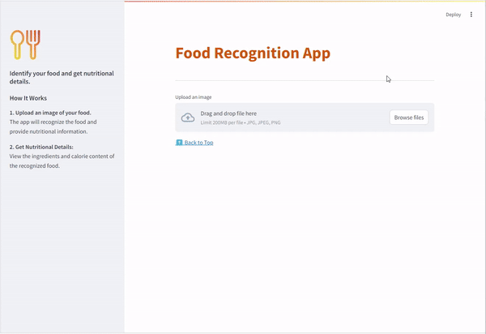

# Food Recognition App

Food Recognition is an AI-Based Free & Open Source Tool designed to recognize various food items from images, providing details such as the name, ingredients, and calories.


Transform your food recognition experience with our powerful tool!
## Table of Contents

- [Food Recognition App](#food-recognition-app)
  - [Table of Contents](#table-of-contents)
  - [How does it work](#how-does-it-work)
  - [How to install](#how-to-install)
  - [Results](#results)
    - [Demo](#demo)

## How does it work

</div>
The Food Recognition tool allows you to upload food images and provides detailed information about the food item, including its category, ingredients, and calorie content.

<h1>Process Overview</h1>
Image Upload: Upload a food image in PNG or JPEG format. The app processes the image to identify the food item.

Image Processing:

The image is processed using a PyTorch model trained to recognize various food categories.
The model extracts relevant features and makes predictions about the food item.
Feature Extraction:

The tool extracts key features from the image and compares them to stored features in the MongoDB database.
Category Prediction:

The app predicts the category of the food item based on its similarity to images in the images_and_categories collection in MongoDB.
Information Display:

The predicted category, ingredients, and calorie content are displayed to the user.
<br/>
<div align="center">

## How to install 
Follow these steps to set up the environment and run the application.

1. Fork the repository
2. Clone the forked repository

  ```bash
   git clone https://github.com/<YOUR-USERNAME>/Food-Image-Recognition-master.git
   cd Food-Image-Recognition-master
   ```

3. Create a Python Virtual Environment:

   - Using [virtualenv](https://learnpython.com/blog/how-to-use-virtualenv-python/):

     _Note_: Check how to install virtualenv on your system here [link](https://learnpython.com/blog/how-to-use-virtualenv-python/).

     ```bash
     virtualenv env
     ```

   **OR**

   - Create a Python Virtual Environment:

     ```bash
     python -m venv env
     ```

4. Activate the Virtual Environment.

   - On Windows.

     ```bash
     env\Scripts\activate
     ```

   - On macOS and Linux.

     ```bash
     source env/bin/activate
     ```

5. Install Dependencies:

   ```bash
   pip install -r requirements.txt
   ```

6. Prepare Data:

   - Images: Place your food images in PNG or JPEG format in the `Data/Images folder`. Remove any existing contents in this folder.

8. Run the Application:

   ```python
   streamlit run tensor_streamlit.py
   ```

## Results

### Demo

